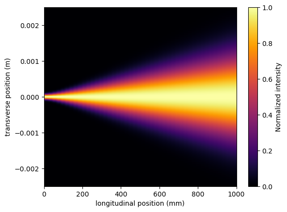

# Topolino

\section*{Overview}

This repository is a Python toolkit for exploring paraxial wave propagation and related optical phenomena. At its core is a Fresnel propagator `propTF` that uses NumPy's FFT to propagate a complex field through space. The package includes routines for generating Gaussian beams, extracting the RMS beam radius from intensity moments, and directly comparing the numerical propagation to the analytical Gaussian‑beam law
$$
\sigma(z)=\sqrt{\sigma_{0}^{2}+(\theta z)^{2}},\qquad 
\theta=\frac{\lambda}{4\pi\sigma_{0}}.
$$
A collection of Jupyter notebooks demonstrates a range of topics: a thin‑lens model, creation and propagation of spiral beams, diffraction patterns of transmission gratings, and a full grating‑experiment simulation that includes a light source, propagation to a grating, and observation of resulting orders. The notebooks expose parameters (wavelength $\lambda$, aperture size, grating period, vortex charge, \ldots), visualize results with 1‑D plots, RMS‑size versus distance curves, and 2‑D intensity maps, and provide side‑by‑side comparisons with analytical predictions where available. 
## Assets

